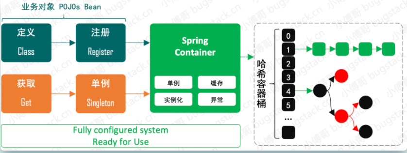
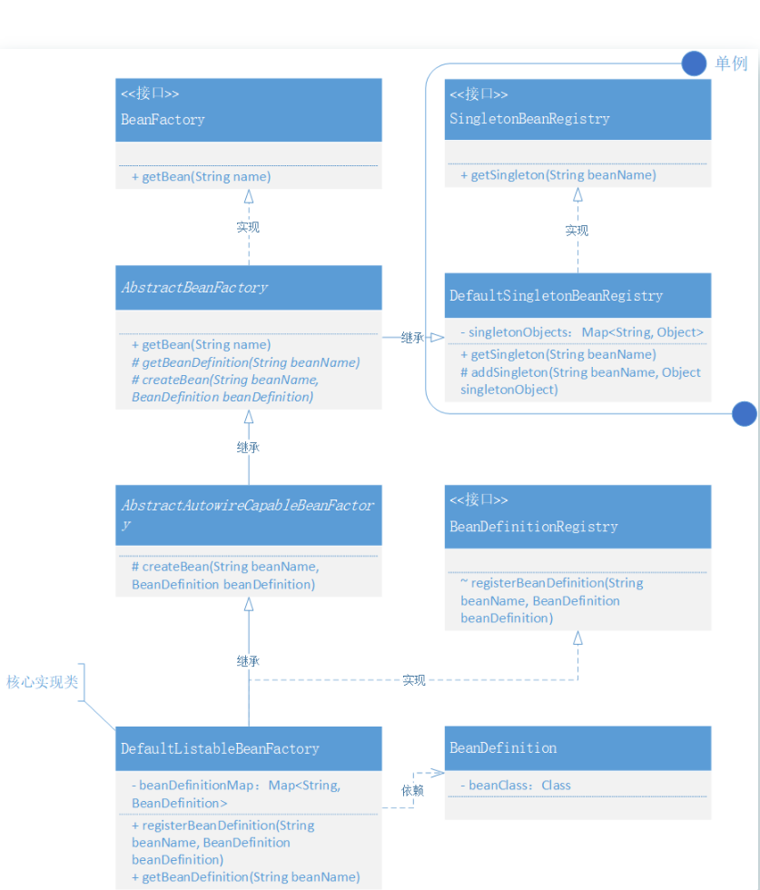

# Spring Bean 容器类关系运用设计模式，实现 Bean 的定义、注册、获取

## **目标**

我们需要结合已实现的 Spring Bean 容器进行功能完善，实现 Bean 容器关于 Bean 对象的注册和获取。

这一次我们把 Bean 的创建交给容器，而不是我们在调用时候传递一个实例化好的 Bean 对象，另外还需要考虑单例对象，在对象的二次获取时是可以从内存中获取对象的。此外不仅要实现功能还需要完善基础容器框架的类结构体，否则将来就很难扩容进去其他的功能了。

## **设计**

1. 首先我们需要定义 BeanFactory 这样一个 Bean 工厂，**提供 Bean 的获取方法** `getBean(String name)`，之后这个 Bean 工厂接口由**抽象类 AbstractBeanFactory 实现**。这样使用**模板模式的设计方式**，可以**统一收口通用核心方法的调用逻辑和标准定义**，也就很好的控制了后续的实现者不用关心调用逻辑，**按照统一方式执行**。那么类的**继承者**只需要关心**具体方法的逻辑实现**即可。
2. 那么在继承抽象类 AbstractBeanFactory 后的 AbstractAutowireCapableBeanFactory 就可以实现相应的抽象方法了，因为 AbstractAutowireCapableBeanFactory 本身也是**一个抽象类**，所以**它只会实现属于自己的抽象方法**，其他抽象方法由继承 AbstractAutowireCapableBeanFactory 的类实现。**这里就体现了类实现过程中的各司其职**，你只需要关心属于你的内容，不是你的内容，不要参与。*这一部分内容我们会在代码里有具体的体现*
3. 另外这里还有块非常重要的知识点，就是关于**单例 SingletonBeanRegistry 的接口定义实现**，而 DefaultSingletonBeanRegistry 对接口实现后，会被抽象类 AbstractBeanFactory 继承。现在 **AbstractBeanFactory 就是一个非常完整且强大的抽象类了**，也能非常好的体现出它对模板模式的抽象定义。*接下来我们就带着这些设计层面的思考，去看代码的具体实现结果*

## Spring Bean 容器类关系

## 

目前实现结果的类关系图来看，其实已经具备了一定的设计复杂性，这些复杂的类关系设计在各个接口定义和实现以及在抽象类继承中都有所体现，例如：

- BeanFactory 的定义由 AbstractBeanFactory 抽象类实现接口的 getBean 方法
- 而 AbstractBeanFactory 又继承了实现了 SingletonBeanRegistry 的DefaultSingletonBeanRegistry 类。这样 AbstractBeanFactory 抽象类就具备了单例 Bean 的注册功能。
- AbstractBeanFactory 中又定义了两个抽象方法：getBeanDefinition(String beanName)、createBean(String beanName, BeanDefinition beanDefinition) ，而这两个抽象方法分别由 DefaultListableBeanFactory、AbstractAutowireCapableBeanFactory 实现。
- 最终 DefaultListableBeanFactory 还会继承抽象类 AbstractAutowireCapableBeanFactory 也就可以调用抽象类中的 createBean 方法了。

综上这一部分的类关系和实现过程还是会有一些复杂的，因为**所有的实现都以职责划分、共性分离以及调用关系定义为标准搭建的类关系**。*这部分内容的学习，可能会丰富你在复杂业务系统开发中的设计思路。*

## **总结**

- 相对于前一章节对 Spring Bean 容器的简单概念实现，本章节中加强了功能的完善。在实现的过程中也可以看到类的关系变得越来越多了，如果没有做过一些稍微复杂的系统类系统，那么即使现在这样9个类搭出来的容器工厂也可以给你绕晕。
- 在 Spring Bean 容器的实现类中要**重点关注类之间的职责和关系**，几乎所有的程序功能设计都离不开**接口、抽象类、实现、继承**，而这些不同特性类的使用就可以非常好的**隔离开类的功能职责和作用范围**。而这样的知识点也是在学习手写 Spring Bean 容器框架过程非常重要的知识。
- 要做一个有成长的程序员要记住代码实现只是最后的落地结果，而那些**设计上的思考才是最有价值的地方**。*就像你是否遇到过，有人让你给一个内容做个描述、文档、说明，你总觉得太简单了没什么可写的，即使要动笔写了也不知道要从哪开始！其实这些知识内容都来源你对整体功能的理解，这就不只是代码开发还包括了需求目标、方案设计、技术实现、逻辑验证等等过程性的内容。所以，不要只是被看似简单的内容忽略了整体全局观，要学会放开视野，开放学习视角。*