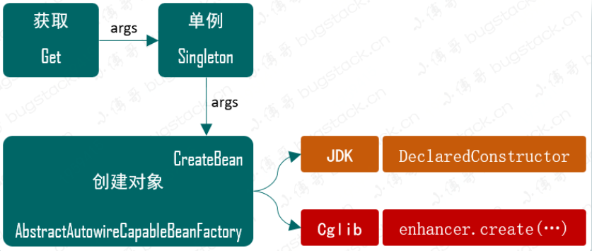
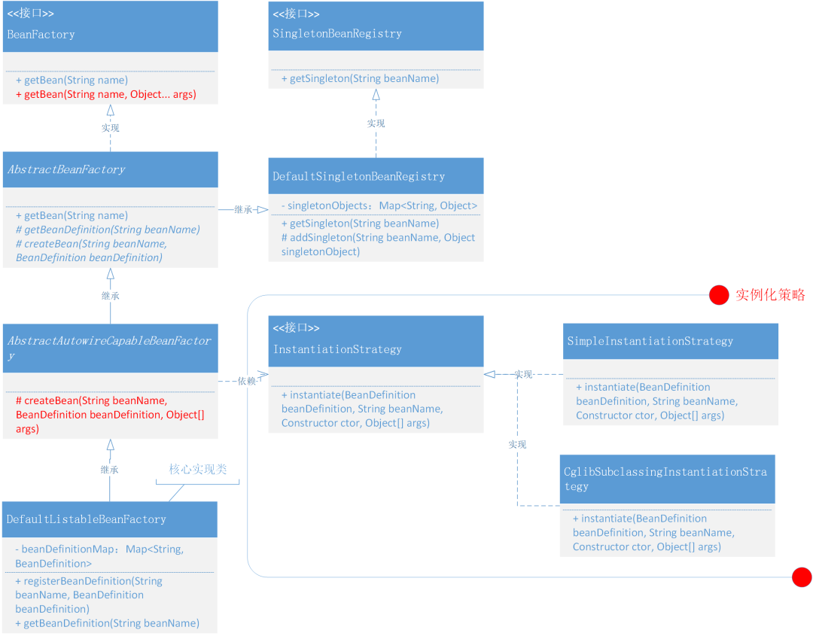

# 基于Cglib实现含构造函数的类实例化策略

## **前言**

**技术成长，是对场景设计细节不断的雕刻！**

更多的编程能力的提升是你对复杂场景的架构把控以及对每一个技术实现细节点的不断用具有规模体量的流量冲击验证时，是否能保证系统稳定运行从而决定你见识了多少、学到了多少、提升了多少！

最终当你在接一个产品需求时，开始思考`程序数据结构的设计`、`核心功能的算法逻辑实现`、`整体服务的设计模式使用`、`系统架构的搭建方式`、`应用集群的部署结构`，那么也就是的编程能力真正提升的时候！

## **目标**

目标主要是为了解决前面代码中我们`埋下的坑`，那是什么坑呢？其实就是一个关于 Bean 对象在含有构造函数进行实例化的坑。

在上一章节我们扩充了 Bean 容器的功能，把实例化对象交给容器来统一处理，但在我们实例化对象的代码里并没有考虑对象类是否含构造函数，也就是说如果我们去实例化一个含有构造函数的对象那么就要抛异常了。

怎么验证？其实就是把 UserService 添加一个含入参信息的构造函数就可以，如下：

```java
public class UserService {

    private String name;

    public UserService(String name) {
        this.name = name;
    }  

    // ...
}
```

**报错如下：**

```java
cn.muxin.springframework.beans.BeansException: Instantiation of bean failed
	at cn.muxin.springframework.beans.factory.support.AbstractAutowireCapableBeanFactory.createBean(AbstractAutowireCapableBeanFactory.java:31)
	at cn.muxin.springframework.beans.factory.support.AbstractBeanFactory.getBean(AbstractBeanFactory.java:35)
	at test.ApiTest.test_BeanFactory(ApiTest.java:34)
```

发生这一现象的主要原因就是因为 `beanDefinition.getBeanClass().newInstance();` 实例化方式并没有考虑构造函数的入参！**那么我们的目标就很明显了，来把这个坑填平！**

## **设计**

填平这个坑的技术设计主要考虑两部分，一个是串流程从哪合理的把构造函数的入参信息传递到实例化操作里，另外一个是怎么去实例化含有构造函数的对象。



- 参考 **Spring Bean 容器源码的实现方式**，在 BeanFactory 中添加 `Object getBean(String name, Object... args)` 接口，这样就可以在获取 Bean 时把构造函数的入参信息传递进去了。
- 另外一个核心的内容是**使用什么方式来创建含有构造函数的 Bean 对象呢**？这里有两种方式可以选择，一个是基于 **Java 本身自带的方法 `DeclaredConstructor`**，另外一个是使用 **Cglib 来动态创建 Bean 对象**。*Cglib 是基于字节码框架 ASM 实现，所以你也可以直接通过 ASM 操作指令码来创建对象*

### Spring Bean 容器类关系



## **总结**

- 主要以完善实例化操作，增加 InstantiationStrategy 实例化策略接口，并新增了两个实例化类。这部分类的名称与实现方式基本是 Spring 框架的一个缩小版，大家在学习过程中也可以从 Spring 源码找到对应的代码。
- 从我们不断的完善增加需求可以看到的，当你的代码结构设计的较为合理的时候，就可以非常容易且方便的进行扩展不同属性的类职责，而不会因为需求的增加导致类结构混乱。所以在我们自己业务需求实现的过程中，也要尽可能的去考虑一个良好的扩展性以及拆分好类的职责。
- 动手是学习起来最快的方式，不要让眼睛是感觉看会了，但上手操作就废了。也希望有需要的读者可以亲手操作一下，把你的想法也融入到可落地实现的代码里，看看想的和做的是否一致。