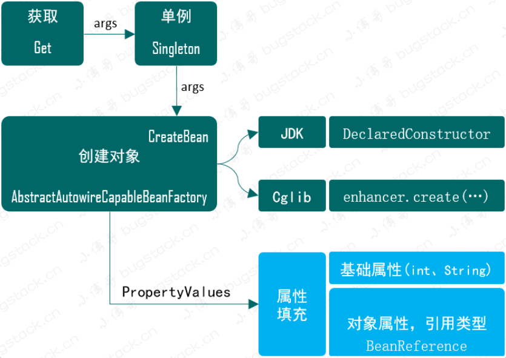
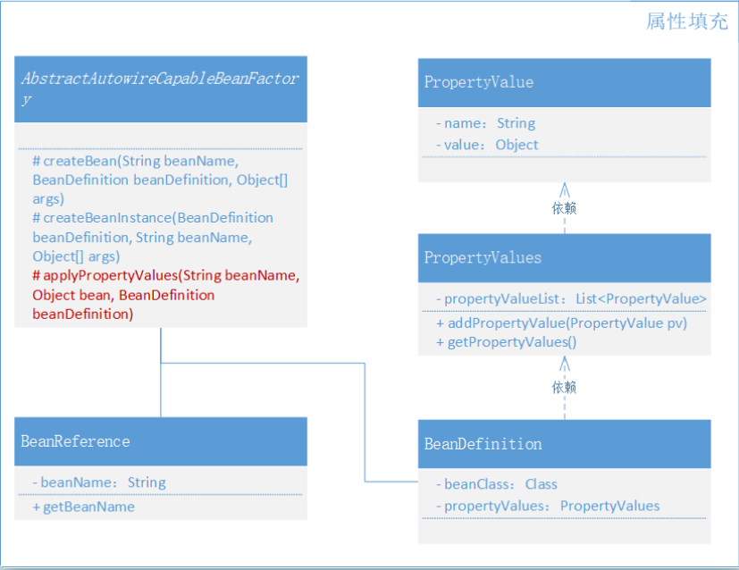

# 为Bean对象注入属性和依赖Bean的功能实现

## **前言**

```
超卖、掉单、幂等，你的程序总是不抗揍！
```

想想，运营已经对外宣传了七八天的活动，满心欢喜的等着最后一天页面上线对外了，突然出现了一堆异常、资损、闪退，而用户流量稍纵即逝，最后想死的心都有！

就编程开发来讲，丢三落四、乱码七糟，可能这就是大部分初级程序员日常开发的真实写照，在即使有测试人员验证的情况下，也会出现带Bug上线的现象，只不过是当时没有发现而已！*因为是人写代码，就一定会有错误，即使是老码农*

就程序Bug来讲，会包括产品PRD流程上的Bug、运营配置活动时候的Bug、研发开发时功能实现的Bug、测试验证时漏掉流程的Bug、上线过程中运维服务相关配置的Bug，而这些其实都可以通过制定的流程规范和一定的研发经验积累，慢慢尽可能减少。

而另外一类是沟通留下的Bug，通常情况下业务提需求、产品定方案、研发做实现，最终还要有UI、测试、运营、架构等等各个环节的人员参与到一个项目的承接、开发到上线运行，而在这一群人需要保持一个统一的信息传播其实是很难的。比如在项目开发中期，运营给产品说了一个新增的需求，产品觉得功能也不大，随即找到对应的前端研发加个逻辑，但没想到可能也影响到了后端的开发和测试的用例。最后功能虽然是上线了，可并不在整个产研测的需求覆盖度范围里，也就隐形的埋下了一个坑。

所以，如果你想让你的程序很抗揍，接的住农夫三拳，那么你要做的就不只是一个单纯的搬砖码农！

## **目标**

在前面我已经实现了，一个容器、定义和注册Bean、实例化Bean，按照是否包含构造函数实现不同的实例化策略。那么在创建对象实例化这我们还缺少什么？其实还**缺少一个关于`类中是否有属性的问题`**，如果有类中包含属性那么在实例化的时候就需要把属性信息填充上，这样才是一个完整的对象创建。

对于属性的填充不只是 int、Long、String，还包括还**没有实例化的对象属性**，都需要在 Bean 创建时进行填充操作。不过这里我们**暂时不会考虑 Bean 的循环依赖**，否则会把整个功能实现撑大，待后续陆续先把核心功能实现后，再逐步完善

## **设计**

鉴于属性填充是在 Bean 使用 `newInstance` 或者 `Cglib` 创建后，开始补全属性信息，那么就可以在类 `AbstractAutowireCapableBeanFactory` 的 createBean 方法中添加补全属性方法。*这部分大家在实习的过程中也可以对照Spring源码学习，这里的实现也是Spring的简化版，后续对照学习会更加易于理解*



- 属性填充要在类实例化创建之后，也就是需要在 `AbstractAutowireCapableBeanFactory` 的 createBean 方法中添加 `applyPropertyValues` 操作。
- 由于我们需要在创建Bean时候填充属性操作，那么就需要在 bean 定义 BeanDefinition 类中，添加 PropertyValues 信息。
- 另外是填充属性信息还包括了 Bean 的对象类型，也就是需要再定义一个 BeanReference，里面其实就是一个简单的 Bean 名称，在具体的实例化操作时进行递归创建和填充，与 Spring 源码实现一样。*Spring 源码中 BeanReference 是一个接口*

## **实现**

### Spring Bean 容器类关系



- 需要新增加3个类，`BeanReference`(类引用)、`PropertyValue`(属性值)、`PropertyValues`(属性集合)，分别用于类和其他类型属性填充操作。
- 另外改动的类主要是 `AbstractAutowireCapableBeanFactory`，在 createBean 中补全属性填充部分。

## **总结**

- 我们把 AbstractAutowireCapableBeanFactory 类中的创建对象功能又做了扩充，依赖于是否有构造函数的实例化策略完成后，开始补充 Bean 属性信息。当遇到 Bean 属性为 Bean 对象时，需要递归处理。最后在属性填充时需要用到反射操作，也可以使用一些工具类处理。
- 每一次的功能点我们都在循序渐进的实现，这样可以让新人更好的接受关于 Spring 中的设计思路。尤其是在一些已经开发好的类上，怎么扩充新的功能时候的设计更为重要。学习编程有的时候学习思路设计要比仅仅是做简单实现，更能提升编程思维。
- 到这一章节关于 Bean 的创建操作就开发完成了，接下来需要整个框架的基础上完成资源属性的加载，就是我们需要去动 Xml 配置了，让我们这小框架越来越像 Spring。另外在框架实现的过程中所有的类名都会参考 Spring 源码，以及相应的设计实现步骤也是与 Spring 源码中对应，只不过会简化一些流程，但你可以拿相同的类名，去搜到每一个功能在 Spring 源码中的实现。