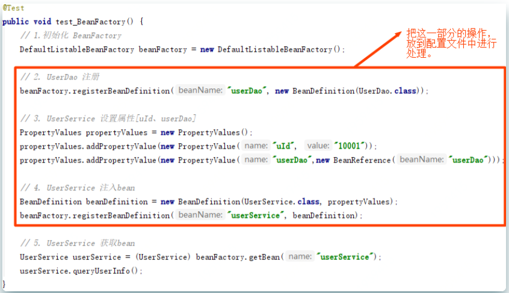
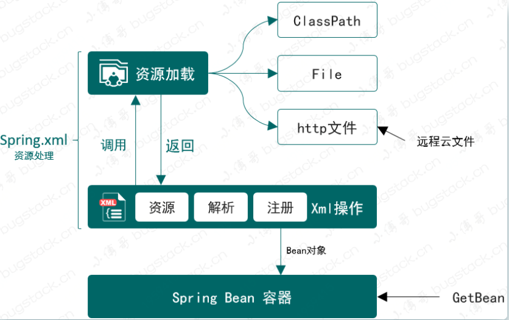
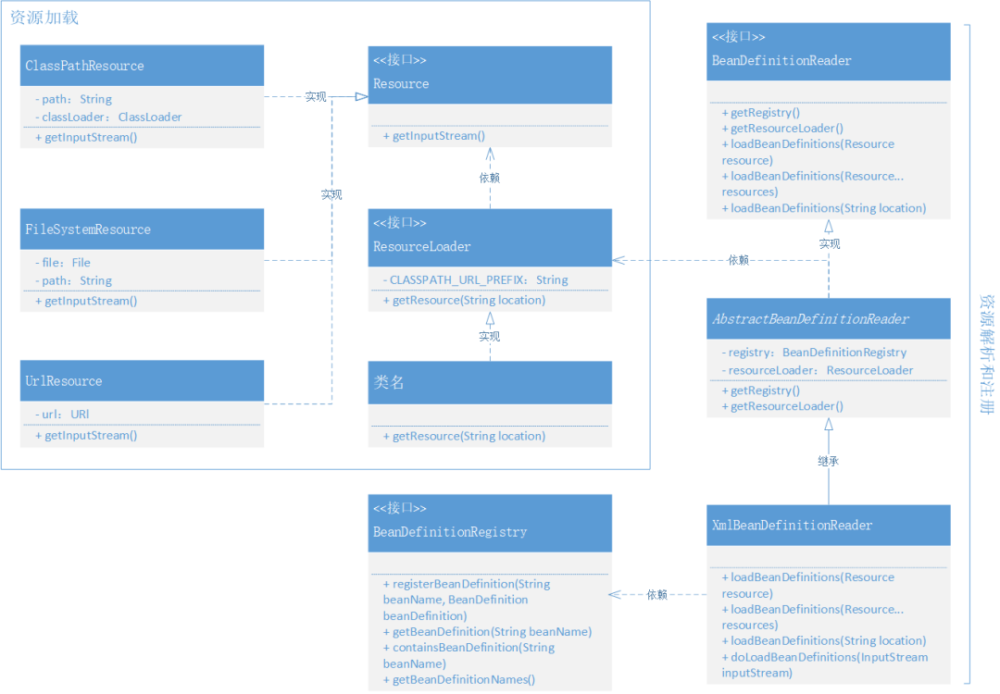
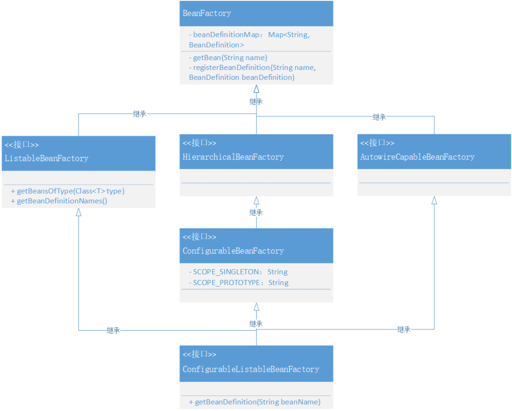

# 设计与实现资源加载器，从Spring.xml解析和注册Bean对象

## **前言**

```
你写的代码，能接的住产品加需求吗？
```

接，是能接的，接几次也行，哪怕就一个类一片的 if...else 也可以！但接完成什么样可就不一定了，会不会出事故也不是能控制住的。

但代码烂了有时候并不是因为需求加的快、也不是着急上线。因为往往在承接产品需求的前几次，一个功能逻辑的设计并不会太复杂，也不会有多急迫，甚至会留出让你做设计、做评审、做开发的时间，如果这个时候仍不能把以后可能会发生的事情评估到需求里，那么导致代码的混乱从一开始就已经埋下了，以后只能越来越乱！

承接需求并能把它做好，这来自于对需求的理解，产品场景开发的经验以及对代码实践落地的把控能力等综合多方面因素的结果。就像你现在做的开发中，你的代码有哪些是经常变化的，有哪些是固定通用的，有哪些是负责逻辑拼装的、有哪些是来做核心实现的。那么现在如果你的核心共用层做了频繁变化的业务层包装，那么肯定的说，你的代码即将越来越乱，甚至可能埋下事故的风险！

在我们实现的 Spring 框架中，每一个章节都会结合上一章节继续扩展功能，就像每一次产品都在加需求一样，那么在学习的过程中可以承上启下的对照和参考，看看每一个模块的添加都是用什么逻辑和技术细节实现的。这些内容的学习，会非常有利于你以后在设计和实现，自己承接产品需求时做的具体开发，代码的质量也会越来越高，越来越有扩展性和可维护性。

## **目标**

在完成 Spring 的框架雏形后，现在我们可以通过单元测试进行手动操作 Bean 对象的定义、注册和属性填充，以及最终获取对象调用方法。但这里会有一个问题，就是如果实际使用这个 Spring 框架，是不太可能让用户通过手动方式创建的，而是最好能通过配置文件的方式简化创建过程。需要完成如下操作：



- 如图中我们需要把步骤：2、3、4整合到Spring框架中，通过 Spring 配置文件的方式将 Bean 对象实例化。
- **接下来我们就需要在现有的 Spring 框架中，添加能解决 Spring 配置的读取、解析、注册Bean的操作。**

## **设计** 

依照这次设计的需求背景，我们需要在现有的 Spring 框架雏形中添加一个资源解析器，也就是能读取classpath、本地文件和云文件的配置内容。这些配置内容就是像使用 Spring 时配置的 Spring.xml 一样，里面会包括 Bean 对象的描述和属性信息。在读取配置文件信息后，接下来就是对配置文件中的 Bean 描述信息解析后进行注册操作，把 Bean 对象注册到 Spring 容器中。整体设计结构如下图：



- 资源加载器属于相对独立的部分，它位于 Spring 框架核心包下的IO实现内容，主要用于处理Class、本地和云环境中的文件信息。
- 当资源可以加载后，接下来就是解析和注册 Bean 到 Spring 中的操作，这部分实现需要和 DefaultListableBeanFactory 核心类结合起来，因为你所有的解析后的注册动作，都会把 Bean 定义信息放入到这个类中。
- 那么在实现的时候就设计好接口的实现层级关系，包括我们需要定义出 Bean 定义的读取接口 `BeanDefinitionReader` 以及做好对应的实现类，在实现类中完成对 Bean 对象的解析和注册。

## **实现**

Spring Bean 容器资源加载和使用类关系，如图



- 为了能把 Bean 的定义、注册和初始化交给 Spring.xml 配置化处理，那么就需要实现两大块内容，分别是：资源加载器、xml资源处理类，实现过程主要以对接口 `Resource`、`ResourceLoader` 的实现，而另外 `BeanDefinitionReader` 接口则是对资源的具体使用，将配置信息注册到 Spring 容器中去。
- 在 Resource 的资源加载器的实现中包括了，ClassPath、系统文件、云配置文件，这三部分与 Spring 源码中的设计和实现保持一致，最终在 DefaultResourceLoader 中做具体的调用。
- 接口：BeanDefinitionReader、抽象类：AbstractBeanDefinitionReader、实现类：XmlBeanDefinitionReader，这三部分内容主要是合理清晰的处理了资源读取后的注册 Bean 容器操作。*接口管定义，抽象类处理非接口功能外的注册Bean组件填充，最终实现类即可只关心具体的业务实现*

另外本章节还参考 Spring 源码，做了相应接口的集成和实现的关系，虽然这些接口目前还并没有太大的作用，但随着框架的逐步完善，它们也会发挥作用。如图



- BeanFactory，已经存在的 Bean 工厂接口用于获取 Bean 对象，这次新增加了按照类型获取 Bean 的方法：`<T> T getBean(String name, Class<T> requiredType)`
- ListableBeanFactory，是一个扩展 Bean 工厂接口的接口，新增加了 `getBeansOfType`、`getBeanDefinitionNames()` 方法，在 Spring 源码中还有其他扩展方法。
- HierarchicalBeanFactory，在 Spring 源码中它提供了可以获取父类 BeanFactory 方法，属于是一种扩展工厂的层次子接口。*Sub-interface implemented by bean factories that can be part of a hierarchy.*
- AutowireCapableBeanFactory，是一个自动化处理Bean工厂配置的接口，目前案例工程中还没有做相应的实现，后续逐步完善。
- ConfigurableBeanFactory，可获取 BeanPostProcessor、BeanClassLoader等的一个配置化接口。
- ConfigurableListableBeanFactory，提供分析和修改Bean以及预先实例化的操作接口，不过目前只有一个 getBeanDefinition 方法。

### 1.资源加载接口定义和实现

```java
public interface Resource {

    InputStream getInputStream() throws IOException;

}
```

- 在 Spring 框架下创建 core.io 核心包，在这个包中主要用于处理资源加载流。
- 定义 Resource 接口，提供获取 InputStream 流的方法，接下来再分别实现三种不同的流文件操作：classPath、FileSystem、URL

**ClassPath**：

cn.muxin.springframework.core.io.ClassPathResource

```java
public class ClassPathResource implements Resource {

    private final String path;

    private ClassLoader classLoader;

    public ClassPathResource(String path) {
        this(path, (ClassLoader) null);
    }

    public ClassPathResource(String path, ClassLoader classLoader) {
        Assert.notNull(path, "Path must not be null");
        this.path = path;
        this.classLoader = (classLoader != null ? classLoader : ClassUtils.getDefaultClassLoader());
    }

    @Override
    public InputStream getInputStream() throws IOException {
        InputStream is = classLoader.getResourceAsStream(path);
        if (is == null) {
            throw new FileNotFoundException(
                    this.path + " cannot be opened because it does not exist");
        }
        return is;
    }
}
```

这一部分的实现是用于通过 `ClassLoader` 读取`ClassPath` 下的文件信息，具体的读取过程主要是：`classLoader.getResourceAsStream(path)`

**FileSystem**：

cn.muxin.springframework.core.io.FileSystemResource

```java
public class FileSystemResource implements Resource {

    private final File file;

    private final String path;

    public FileSystemResource(File file) {
        this.file = file;
        this.path = file.getPath();
    }

    public FileSystemResource(String path) {
        this.file = new File(path);
        this.path = path;
    }

    @Override
    public InputStream getInputStream() throws IOException {
        return new FileInputStream(this.file);
    }

    public final String getPath() {
        return this.path;
    }

}
```

- 通过指定文件路径的方式读取文件信息，这部分大家肯定还是非常熟悉的，经常会读取一些txt、excel文件输出到控制台。

**Url**：cn.muxin.springframework.core.io.UrlResource

```java
public class UrlResource implements Resource{

    private final URL url;

    public UrlResource(URL url) {
        Assert.notNull(url,"URL must not be null");
        this.url = url;
    }

    @Override
    public InputStream getInputStream() throws IOException {
        URLConnection con = this.url.openConnection();
        try {
            return con.getInputStream();
        }
        catch (IOException ex){
            if (con instanceof HttpURLConnection){
                ((HttpURLConnection) con).disconnect();
            }
            throw ex;
        }
    }

}
```

- 通过 HTTP 的方式读取云服务的文件，我们也可以把配置文件放到 GitHub 或者 Gitee 上。

### 2.包装资源加载器

按照资源加载的不同方式，资源加载器可以把这些方式集中到统一的类服务下进行处理，外部用户只需要传递资源地址即可，简化使用。

**定义接口**：cn.muxin.springframework.core.io.ResourceLoader

```java
public interface ResourceLoader {

    /**
     * Pseudo URL prefix for loading from the class path: "classpath:"
     */
    String CLASSPATH_URL_PREFIX = "classpath:";

    Resource getResource(String location);

}
```

- 定义获取资源接口，里面传递 location 地址即可。

**实现接口**：

cn.muxin.springframework.core.io.DefaultResourceLoader

```java
public class DefaultResourceLoader implements ResourceLoader {

    @Override
    public Resource getResource(String location) {
        Assert.notNull(location, "Location must not be null");
        if (location.startsWith(CLASSPATH_URL_PREFIX)) {
            return new ClassPathResource(location.substring(CLASSPATH_URL_PREFIX.length()));
        }
        else {
            try {
                URL url = new URL(location);
                return new UrlResource(url);
            } catch (MalformedURLException e) {
                return new FileSystemResource(location);
            }
        }
    }

}
```

- 在获取资源的实现中，主要是把三种不同类型的资源处理方式进行了包装，分为：判断是否为ClassPath、URL以及文件。
- 虽然 DefaultResourceLoader 类实现的过程简单，但这也是设计模式约定的具体结果，像是这里不会让外部调用放知道过多的细节，而是仅关心具体调用结果即可。

### 3.Bean定义读取接口

**cn.muxin.springframework.beans.factory.support.BeanDefinitionReader**

```java
public interface BeanDefinitionReader {

    BeanDefinitionRegistry getRegistry();

    ResourceLoader getResourceLoader();

    void loadBeanDefinitions(Resource resource) throws BeansException;

    void loadBeanDefinitions(Resource... resources) throws BeansException;

    void loadBeanDefinitions(String location) throws BeansException;

}

```

- 这是一个 *Simple interface for bean definition readers.* 其实里面无非定义了几个方法，包括：getRegistry()、getResourceLoader()，以及三个加载Bean定义的方法。
- 这里需要注意 getRegistry()、getResourceLoader()，都是用于提供给后面三个方法的工具，加载和注册，这两个方法的实现会包装到抽象类中，以免污染具体的接口实现方法。

### 4.Bean定义抽象类实现

**cn.muxin.springframework.beans.factory.support.AbstractBeanDefinitionReader**

```java
public abstract class AbstractBeanDefinitionReader implements BeanDefinitionReader {

    private final BeanDefinitionRegistry registry;

    private ResourceLoader resourceLoader;

    protected AbstractBeanDefinitionReader(BeanDefinitionRegistry registry) {
        this(registry, new DefaultResourceLoader());
    }

    public AbstractBeanDefinitionReader(BeanDefinitionRegistry registry, ResourceLoader resourceLoader) {
        this.registry = registry;
        this.resourceLoader = resourceLoader;
    }

    @Override
    public BeanDefinitionRegistry getRegistry() {
        return registry;
    }

    @Override
    public ResourceLoader getResourceLoader() {
        return resourceLoader;
    }

}
```

