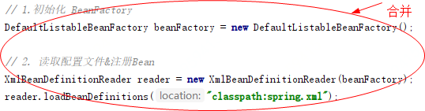

# 实现应用上下文，自动识别、资源加载、扩展机制

## 前言

```
你这代码，可不能写死了呀！
```

依照项目落地经验来看，我们在承接紧急的产品需求时候，通常会选择在原有同类项目中进行扩展，如果没有相关类型项目的储备，也可能会选择临时搭建出一个工程来实现产品的需求。但这个时候就会遇到非常现实的问题，选择完整的设计和开发就可能满足不了上线时间，临时拼凑式的完成需求又可能不具备上线后响应产品的临时调整。

上线后的调整有哪些呢？项目刚一上线，运营了还不到半天，老板发现自己的配置的活动好像金额配置的太小了，用户都不来，割不到韭菜呀。`赶紧半夜联系产品，来来来，你给我这改改，那修修，把人均优惠1万元放大大的，把可能两字缩小放在后面。再把优惠的奖金池配置从10元调整11元，快快快，赶紧修改，你修改了咱们能赚1个亿！！！`

好家伙，项目是临时开发堆出来的，没有后台系统、没有配置中心、没有模块拆分，老板一句句改改改，产品来传达催促，最后背锅的可就是研发了。*你这不能写死，这优惠配置得抽出来，这文案也后台下发吧，这接口入参也写死了，再写一个新接口吧！* 一顿操作猛如虎，研发搬砖修接口，运营折腾好几宿，最后PV150！

无论业务、产品、运营如何，但就研发自身来讲，尽可能的要不避免临时堆出一个服务来，尤其是在团队建设初期或者运营思路经常调整的情况下，更要注重设计细节和实现方案。哪怕去报风险延期，也不要让自己背上一个明知是烂坑还要接的活。

而本章节说到`不把代码写死`，就是因为我们需要继续在手写 Spring 框架中继续扩展新的功能，如一个Bean的定义和实例化的过程前后，是否可以满足我们进行自定义扩展，对Bean对象执行一些修改、增强、记录等操作呢？*这个过程基本就是你在使用 Spring 容器框架时候做的一些中间件扩展开发。*

## **目标**

如果你在自己的实际工作中开发过基于 Spring 的技术组件，或者学习过关于 SpringBoot 中间件设计和开发 等内容。那么你一定会继承或者实现了 Spring 对外暴露的类或接口，在接口的实现中获取了 BeanFactory 以及 Bean 对象的获取等内容，并对这些内容做一些操作，例如：修改 Bean 的信息，添加日志打印、处理数据库路由对数据源的切换、给 RPC 服务连接注册中心等。

在对容器中 Bean 的实例化过程添加扩展机制的同时，还需要把目前关于 Spring.xml 初始化和加载策略进行优化，因为我们不太可能让面向 Spring 本身开发的 `DefaultListableBeanFactory` 服务，直接给予用户使用。修改点如下：



- DefaultListableBeanFactory、XmlBeanDefinitionReader，是我们在目前 Spring 框架中对于服务功能测试的使用方式，它能很好的体现出 Spring 是如何对 xml 加载以及注册Bean对象的操作过程，但这种方式是面向 Spring 本身的，还不具备一定的扩展性。
- 就像我们现在需要提供出一个可以在 Bean 初始化过程中，完成对 Bean 对象的扩展时，就很难做到自动化处理。所以我们要把 Bean 对象扩展机制功能和对 Spring 框架上下文的包装融合起来，对外提供完整的服务。

## **设计** 

为了能满足于在 Bean 对象从注册到实例化的过程中执行用户的自定义操作，就需要在 Bean 的定义和初始化过程中插入接口类，这个接口再有外部去实现自己需要的服务。那么在结合对 Spring 框架上下文的处理能力，就可以满足我们的目标需求了。整体设计结构如下图：


- 满足于对 Bean 对象扩展的两个接口，其实也是 Spring 框架中非常具有重量级的两个接口：`BeanFactoryPostProcess` 和 `BeanPostProcessor`，也几乎是大家在使用 Spring 框架额外新增开发自己组建需求的两个必备接口。
- BeanFactoryPostProcessor，是由 Spring 框架组建提供的容器扩展机制，允许在 Bean 对象注册后但未实例化之前，对 Bean 的定义信息 `BeanDefinition` 执行修改操作。
- BeanPostProcessor，也是 Spring 提供的扩展机制，不过 BeanPostProcessor 是在 Bean 对象实例化之后修改 Bean 对象，也可以替换 Bean 对象。这部分与后面要实现的 AOP 有着密切的关系。
- 同时如果只是添加这两个接口，不做任何包装，那么对于使用者来说还是非常麻烦的。我们希望于开发 Spring 的上下文操作类，把相应的 XML 加载 、注册、实例化以及新增的修改和扩展都融合进去，让 Spring 可以自动扫描到我们的新增服务，便于用户使用。

## **实现**

Spring 应用上下文和对Bean对象扩展机制的类关系


- 在整个类图中主要体现出来的是关于 Spring 应用上下文以及对 Bean 对象扩展机制的实现。
- 以继承了 ListableBeanFactory 接口的 ApplicationContext 接口开始，扩展出一系列应用上下文的抽象实现类，并最终完成 `ClassPathXmlApplicationContext` 类的实现。而这个类就是最后交给用户使用的类。
- 同时在实现应用上下文的过程中，通过定义接口：`BeanFactoryPostProcessor`、`BeanPostProcessor` 两个接口，把关于对 Bean 的扩展机制串联进去了。

### 1.定义 BeanFactoryPostProcessor

**cn.muxin.springframework.beans.factory.config.BeanFactoryPostProcessor**

```java
public interface BeanFactoryPostProcessor {

    /**
     * 在所有的 BeanDefinition 加载完成后，实例化 Bean 对象之前，提供修改 BeanDefinition 属性的机制
     *
     * @param beanFactory
     * @throws BeansException
     */
    void postProcessBeanFactory(ConfigurableListableBeanFactory beanFactory) throws BeansException;

}
```

- 在 Spring 源码中有这样一段描述 `Allows for custom modification of an application context's bean definitions,adapting the bean property values of the context's underlying bean factory.` 其实也就是说这个接口是满足于在所有的 BeanDefinition 加载完成后，实例化 Bean 对象之前，提供修改 BeanDefinition 属性的机制。

### 2. 定义 BeanPostProcessor

**cn.muxin.springframework.beans.factory.config.BeanPostProcessor**

```java
public interface BeanPostProcessor {

    /**
     * 在 Bean 对象执行初始化方法之前，执行此方法
     *
     * @param bean
     * @param beanName
     * @return
     * @throws BeansException
     */
    Object postProcessBeforeInitialization(Object bean, String beanName) throws BeansException;

    /**
     * 在 Bean 对象执行初始化方法之后，执行此方法
     *
     * @param bean
     * @param beanName
     * @return
     * @throws BeansException
     */
    Object postProcessAfterInitialization(Object bean, String beanName) throws BeansException;

}
```

- 在 Spring 源码中有这样一段描述 `Factory hook that allows for custom modification of new bean instances,e.g. checking for marker interfaces or wrapping them with proxies.`也就是提供了修改新实例化 Bean 对象的扩展点。
- 另外此接口提供了两个方法：`postProcessBeforeInitialization` 用于在 Bean 对象执行初始化方法之前，执行此方法、`postProcessAfterInitialization`用于在 Bean 对象执行初始化方法之后，执行此方法。

### 3.定义上下文接口

**cn.muxin.springframework.context.ApplicationContext**

```java
public interface ApplicationContext extends ListableBeanFactory {
}
```

- context 是本次实现应用上下文功能新增的服务包
- ApplicationContext，继承于 ListableBeanFactory，也就继承了关于 BeanFactory 方法，比如一些 getBean 的方法。另外 ApplicationContext 本身是 Central 接口，但目前还不需要添加一些获取ID和父类上下文，所以暂时没有接口方法的定义。

**cn.muxin.springframework.context.ConfigurableApplicationContext**

```java
public interface ConfigurableApplicationContext extends ApplicationContext {

    /**
     * 刷新容器
     *
     * @throws BeansException
     */
    void refresh() throws BeansException;

}
```

- ConfigurableApplicationContext 继承自 ApplicationContext，并提供了 refresh 这个核心方法。*如果你有看过一些 Spring 源码，那么一定会看到这个方法。* 接下来也是需要在上下文的实现中完成刷新容器的操作过程。

###  4.应用上下文抽象类实现

**cn.muxin.springframework.context.support.AbstractApplicationContext**

```java
public abstract class AbstractApplicationContext extends DefaultResourceLoader implements ConfigurableApplicationContext {

    @Override
    public void refresh() throws BeansException {
        // 1. 创建 BeanFactory，并加载 BeanDefinition
        refreshBeanFactory();

        // 2. 获取 BeanFactory
        ConfigurableListableBeanFactory beanFactory = getBeanFactory();

        // 3. 在 Bean 实例化之前，执行 BeanFactoryPostProcessor (Invoke factory processors registered as beans in the context.)
        invokeBeanFactoryPostProcessors(beanFactory);

        // 4. BeanPostProcessor 需要提前于其他 Bean 对象实例化之前执行注册操作
        registerBeanPostProcessors(beanFactory);

        // 5. 提前实例化单例Bean对象
        beanFactory.preInstantiateSingletons();
    }

    protected abstract void refreshBeanFactory() throws BeansException;

    protected abstract ConfigurableListableBeanFactory getBeanFactory();

    private void invokeBeanFactoryPostProcessors(ConfigurableListableBeanFactory beanFactory) {
        Map<String, BeanFactoryPostProcessor> beanFactoryPostProcessorMap = beanFactory.getBeansOfType(BeanFactoryPostProcessor.class);
        for (BeanFactoryPostProcessor beanFactoryPostProcessor : beanFactoryPostProcessorMap.values()) {
            beanFactoryPostProcessor.postProcessBeanFactory(beanFactory);
        }
    }

    private void registerBeanPostProcessors(ConfigurableListableBeanFactory beanFactory) {
        Map<String, BeanPostProcessor> beanPostProcessorMap = beanFactory.getBeansOfType(BeanPostProcessor.class);
        for (BeanPostProcessor beanPostProcessor : beanPostProcessorMap.values()) {
            beanFactory.addBeanPostProcessor(beanPostProcessor);
        }
    }
    
    //... getBean、getBeansOfType、getBeanDefinitionNames 方法

}
```

- AbstractApplicationContext 继承 DefaultResourceLoader 是为了处理 `spring.xml` 配置资源的加载。

- 之后是在 refresh() 定义实现过程，包括：

- 1. 创建 BeanFactory，并加载 BeanDefinition
  2. 获取 BeanFactory
  3. 在 Bean 实例化之前，执行 BeanFactoryPostProcessor (Invoke factory processors registered as beans in the context.)
  4. BeanPostProcessor 需要提前于其他 Bean 对象实例化之前执行注册操作
  5. 提前实例化单例Bean对象

- 另外把定义出来的抽象方法，refreshBeanFactory()、getBeanFactory() 由后面的继承此抽象类的其他抽象类实现。

### 5.获取Bean工厂和加载资源

**cn.muxin.springframework.context.support.AbstractRefreshableApplicationContext**

```java
public abstract class AbstractRefreshableApplicationContext extends AbstractApplicationContext {

    private DefaultListableBeanFactory beanFactory;

    @Override
    protected void refreshBeanFactory() throws BeansException {
        DefaultListableBeanFactory beanFactory = createBeanFactory();
        loadBeanDefinitions(beanFactory);
        this.beanFactory = beanFactory;
    }

    private DefaultListableBeanFactory createBeanFactory() {
        return new DefaultListableBeanFactory();
    }

    protected abstract void loadBeanDefinitions(DefaultListableBeanFactory beanFactory);

    @Override
    protected ConfigurableListableBeanFactory getBeanFactory() {
        return beanFactory;
    }

}
```

- 在 refreshBeanFactory() 中主要是获取了 `DefaultListableBeanFactory` 的实例化以及对资源配置的加载操作 `loadBeanDefinitions(beanFactory)`，在加载完成后即可完成对 spring.xml 配置文件中 Bean 对象的定义和注册，同时也包括实现了接口 BeanFactoryPostProcessor、BeanPostProcessor 的配置 Bean 信息。
- 但此时资源加载还只是定义了一个抽象类方法 `loadBeanDefinitions(DefaultListableBeanFactory beanFactory)`，继续由其他抽象类继承实现。

### 6.上下文中对配置信息的加载

**cn.muxin.springframework.context.support.AbstractXmlApplicationContext**

```java
public abstract class AbstractXmlApplicationContext extends AbstractRefreshableApplicationContext {

    @Override
    protected void loadBeanDefinitions(DefaultListableBeanFactory beanFactory) {
        XmlBeanDefinitionReader beanDefinitionReader = new XmlBeanDefinitionReader(beanFactory, this);
        String[] configLocations = getConfigLocations();
        if (null != configLocations){
            beanDefinitionReader.loadBeanDefinitions(configLocations);
        }
    }

    protected abstract String[] getConfigLocations();

}
```

- 在 AbstractXmlApplicationContext 抽象类的 loadBeanDefinitions 方法实现中，使用 XmlBeanDefinitionReader 类，处理了关于 XML 文件配置信息的操作。
- 同时这里又留下了一个抽象类方法，getConfigLocations()，此方法是为了从入口上下文类，拿到配置信息的地址描述。

### 7.应用上下文实现类(ClassPathXmlApplicationContext)

**cn.muxin.springframework.context.support.ClassPathXmlApplicationContext**

```java
public class ClassPathXmlApplicationContext extends AbstractXmlApplicationContext {

    private String[] configLocations;

    public ClassPathXmlApplicationContext() {
    }

    /**
     * 从 XML 中加载 BeanDefinition，并刷新上下文
     *
     * @param configLocations
     * @throws BeansException
     */
    public ClassPathXmlApplicationContext(String configLocations) throws BeansException {
        this(new String[]{configLocations});
    }

    /**
     * 从 XML 中加载 BeanDefinition，并刷新上下文
     * @param configLocations
     * @throws BeansException
     */
    public ClassPathXmlApplicationContext(String[] configLocations) throws BeansException {
        this.configLocations = configLocations;
        refresh();
    }

    @Override
    protected String[] getConfigLocations() {
        return configLocations;
    }

}
```

- ClassPathXmlApplicationContext，是具体对外给用户提供的应用上下文方法。
- 在继承了 AbstractXmlApplicationContext 以及层层抽象类的功能分离实现后，在此类 ClassPathXmlApplicationContext 的实现中就简单多了，主要是对继承抽象类中方法的调用和提供了配置文件地址信息。

### 8.在Bean创建时完成前置和后置处理

**cn.muxin.springframework.beans.factory.support.AbstractAutowireCapableBeanFactory**

```java
public abstract class AbstractAutowireCapableBeanFactory extends AbstractBeanFactory implements AutowireCapableBeanFactory {

    private InstantiationStrategy instantiationStrategy = new CglibSubclassingInstantiationStrategy();

    @Override
    protected Object createBean(String beanName, BeanDefinition beanDefinition, Object[] args) throws BeansException {
        Object bean = null;
        try {
            bean = createBeanInstance(beanDefinition, beanName, args);
            // 给 Bean 填充属性
            applyPropertyValues(beanName, bean, beanDefinition);
            // 执行 Bean 的初始化方法和 BeanPostProcessor 的前置和后置处理方法
            bean = initializeBean(beanName, bean, beanDefinition);
        } catch (Exception e) {
            throw new BeansException("Instantiation of bean failed", e);
        }

        addSingleton(beanName, bean);
        return bean;
    }

    public InstantiationStrategy getInstantiationStrategy() {
        return instantiationStrategy;
    }

    public void setInstantiationStrategy(InstantiationStrategy instantiationStrategy) {
        this.instantiationStrategy = instantiationStrategy;
    }

    private Object initializeBean(String beanName, Object bean, BeanDefinition beanDefinition) {
        // 1. 执行 BeanPostProcessor Before 处理
        Object wrappedBean = applyBeanPostProcessorsBeforeInitialization(bean, beanName);

        // 待完成内容：invokeInitMethods(beanName, wrappedBean, beanDefinition);
        invokeInitMethods(beanName, wrappedBean, beanDefinition);

        // 2. 执行 BeanPostProcessor After 处理
        wrappedBean = applyBeanPostProcessorsAfterInitialization(bean, beanName);
        return wrappedBean;
    }

    private void invokeInitMethods(String beanName, Object wrappedBean, BeanDefinition beanDefinition) {

    }

    @Override
    public Object applyBeanPostProcessorsBeforeInitialization(Object existingBean, String beanName) throws BeansException {
        Object result = existingBean;
        for (BeanPostProcessor processor : getBeanPostProcessors()) {
            Object current = processor.postProcessBeforeInitialization(result, beanName);
            if (null == current) return result;
            result = current;
        }
        return result;
    }

    @Override
    public Object applyBeanPostProcessorsAfterInitialization(Object existingBean, String beanName) throws BeansException {
        Object result = existingBean;
        for (BeanPostProcessor processor : getBeanPostProcessors()) {
            Object current = processor.postProcessAfterInitialization(result, beanName);
            if (null == current) return result;
            result = current;
        }
        return result;
    }

}
```

- 实现 BeanPostProcessor 接口后，会涉及到两个接口方法，`postProcessBeforeInitialization`、`postProcessAfterInitialization`，分别作用于 Bean 对象执行初始化前后的额外处理。
- 也就是需要在创建 Bean 对象时，在 createBean 方法中添加 `initializeBean(beanName, bean, beanDefinition);` 操作。而这个操作主要主要是对于方法 `applyBeanPostProcessorsBeforeInitialization`、`applyBeanPostProcessorsAfterInitialization` 的使用。
- 另外需要提一下，applyBeanPostProcessorsBeforeInitialization、applyBeanPostProcessorsAfterInitialization 两个方法是在接口类 `AutowireCapableBeanFactory` 中新增加的。

## **总结**

- 本次主要新增了 Spring 框架中两个非常重要的接口 BeanFactoryPostProcess、BeanPostProcessor 同时还添加了关于应用上下文的实现，ApplicationContext 接口的定义是继承 BeanFactory 外新增加功能的接口，它可以满足于**自动识别、资源加载、容器事件、监听器等功能**，同时例如一些国际化支持、单例Bean自动初始化等，也是可以在这个类里实现和扩充的。
- 通过本文的实现一定会非常了解 BeanFactoryPostProcess、BeanPostProcessor，以后再做一些关于 Spring 中间件的开发时，如果需要用到 Bean 对象的获取以及修改一些属性信息，那么就可以使用这两个接口了。同时 BeanPostProcessor 也是实现 AOP 切面技术的关键所在。
- 有人问：`面试问那么多，可是工作又用不到，是嘎哈么呢？`，嘎哈么，那你说你开车上桥的时候，会每次都撞两边的护栏吗，不撞是吧，那不要修了哇，直接就铺一个平板，还省材料了。其实核心技术的原理学习，是更有助于你完成更复杂的架构设计，当你的知识能更全面覆盖所承接的需求时，也就能更好的做出合理的架构和落地。
